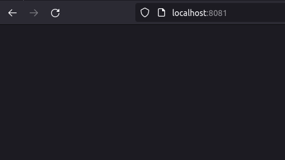
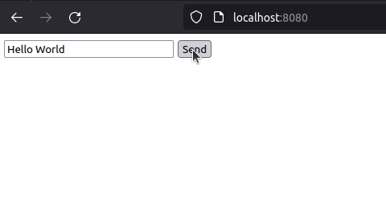
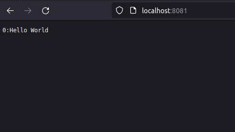

# Overview

Because kafka is oriented to events, this _proyect_ uses the event of a button to send the text in the input as a message and the consumer, running in other end-point can respond to each event, in this case the consumer sends to the page the messages received with an enumeration of order, this doesn't make the page refresh itself, instead to see changes you should update the page(F5)

| Consumer Before Event| Event Produced in Producer | Consumer After Event |
| --- | --- | --- | 
|  |  |  |

# Guide

There are ways to 

### Docker Compose (Recommended)

You can run `docker-compose up -d` and the container will be running on localhost:8081, producer on localhost:8080

---

### Kubernetes

The files `service.yaml` & `deployment.yaml` are files for kubernetes, to create deployments you should apply both files
```
kubectl apply -f ./deployment.yaml
kubectl apply -f ./service.yaml
```

The producer and consumer would be reached at `<nodeIp>:3000` & `<nodeIp>:3001` at default 

---

## Run locally

### Run the zookeeper server
``` 
<kafka-dir>/bin/zookeeper-server-start.sh <kafka-dir>/config/zookeeper.properties 
```

### Run the kafka server
```
<kafka-dir>/bin/kafka-server-start.sh <kafka-dir>/config/server.properties
```

### Create a topic named ```test-topic``` running on ```localhost:9092```
``` 
<kafka-dir>/bin/kafka-topics.sh --create --topic test-topic --bootstrap-server localhost:9092
```

The name(test-topic) and the broker(localhost:9092) are related to code in the index.js file

_index.js:4_ 
```
const kafka = new Kafka({ ...
  brokers: ['localhost:9092'], ...
```

_index.js:13_
```
const producer = kafka.producer()
...
    await producer.send({ ...
    topic: 'test-topic', ...
```

_index.js:23_ 
```
const consumer = kafka.consumer({ groupId: 'test-group' })
...
    await consumer.subscribe({ topic: 'test-topic', fromBeginning: true })
```

### Run the javascript file
```
node index.js
```

Now you should be looking this in the console
```
{ value: 'Hello KafkaJS user!' }
```

> To send messages from the console(the index.js file will be listening) use the following command and start sending messages
```
bin/kafka-console-producer.sh --topic test-topic --bootstrap-server localhost:9092
```

---

### OCI (Free Shape isn't enough to run docker-compose)

There are terraforms files for provide oci infrastructure, there only should be updated the security list of the public subnet manually to allow traffic to 8080-8081 ports, and the instance should be configurated manually

```
cd terraform/
terraform plan
terraform apply
```